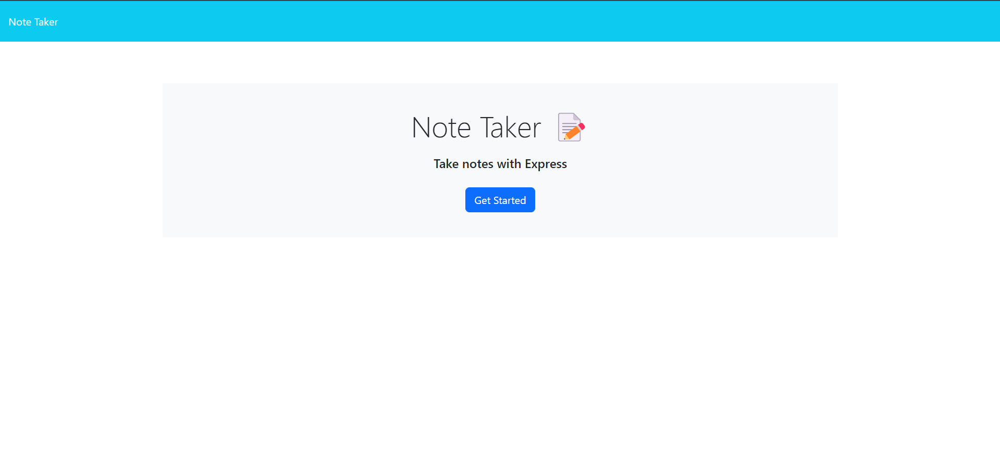
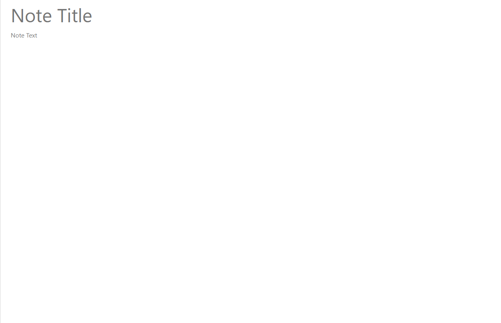
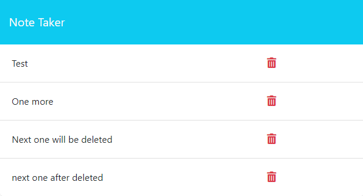

# My Note Taker
Live Link:
https://my-note-taker-rrsv.onrender.com

## Description

This app allows users to store and delete notes.

## Features

Users will add notes by clicking on "Get Started", then will input title and notes.

Users can delete notes by clicking on the trash icon.

## Technologies

Express.js
Node.js
JavaScript
CSS
HTML

## Usage

Click the "Get Started",
Choose the title of your note and write down your notes.
You can delete a note by clicking on the trash icon.

## License

MIT License